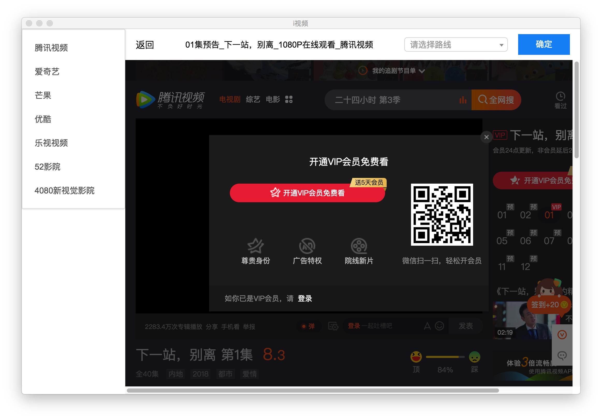
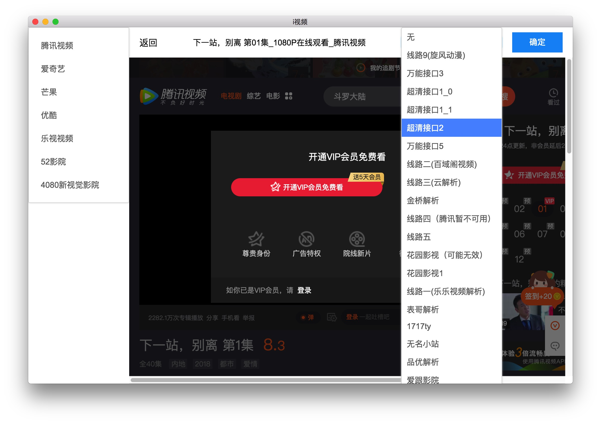
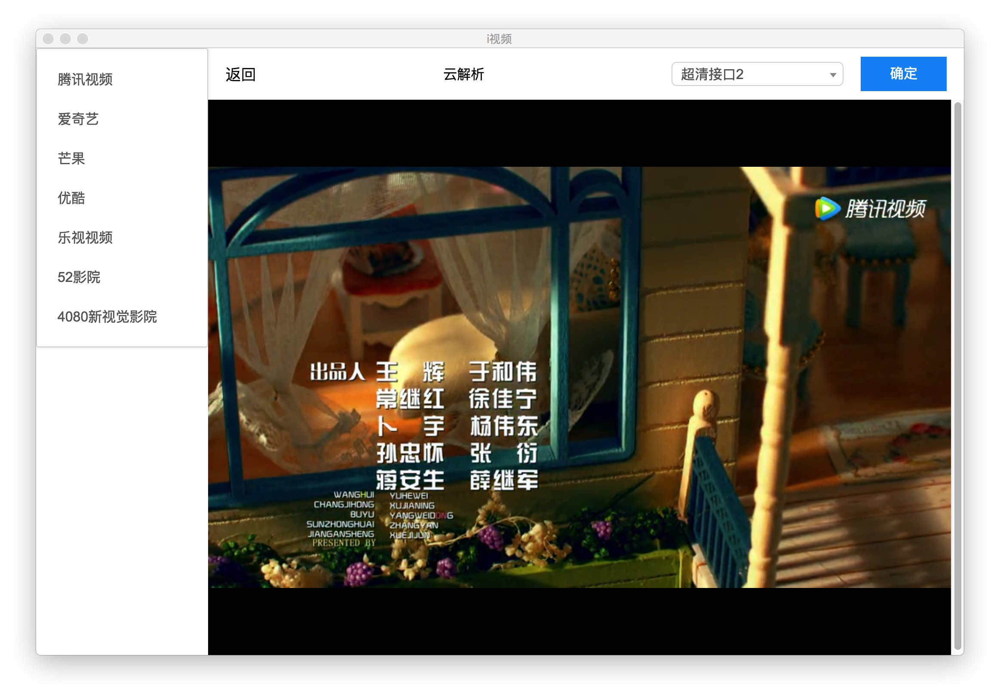

### i视频
#### 产品介绍
> 基于 Electron 开发的跨平台客户端版本的视频播放器，该播放器包括国内主流视频平台视频资源，你不用去单独下载各个平台的客户端，只需要使用这一个客户端就能查看所有平台的视频，并且内置了各大视频网站 VIP 资源。

#### 使用方法

1. 下载客户端 
* [Mac](https://github.com/phobal/ivideo/releases/download/1.0.1/ivideo-1.0.1.dmg)
* [Windows](https://github.com/phobal/ivideo/releases/download/1.0.1/ivideo.Setup.1.0.1.exe)
* [Ubuntu](https://github.com/phobal/ivideo/releases/download/1.0.0/linux-unpacked.v1.0.0.zip)

2. 选择视频资源  

比方说看腾讯视频上的 VIP 才能看的《下一站,别离》

点击进去以后提示需要开通VIP才能看

3. 选择资源播放接口  

点击【确定】按钮就可以播放了，如果遇到无法播放的情况，请多换几条线路试试

### 技术栈

* Electron
* React
* Redux

# 最后请大家低调使用，祝大家看得舒心
